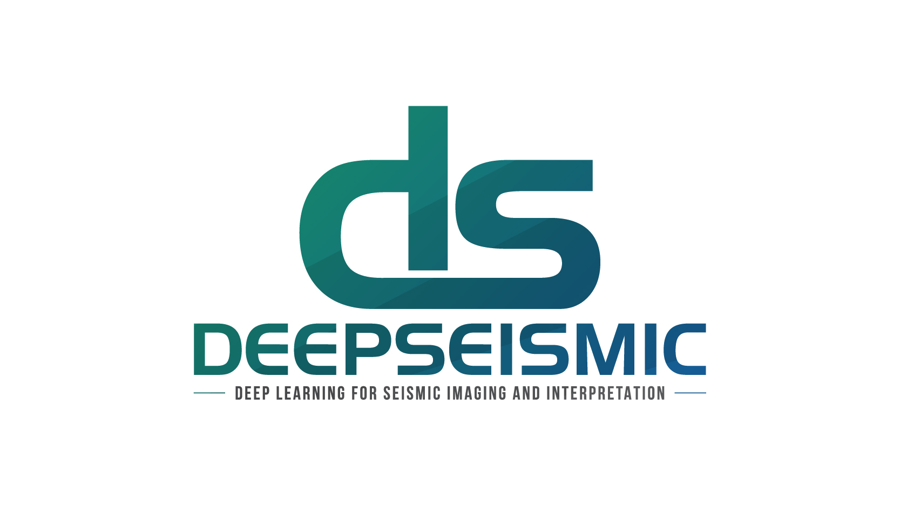
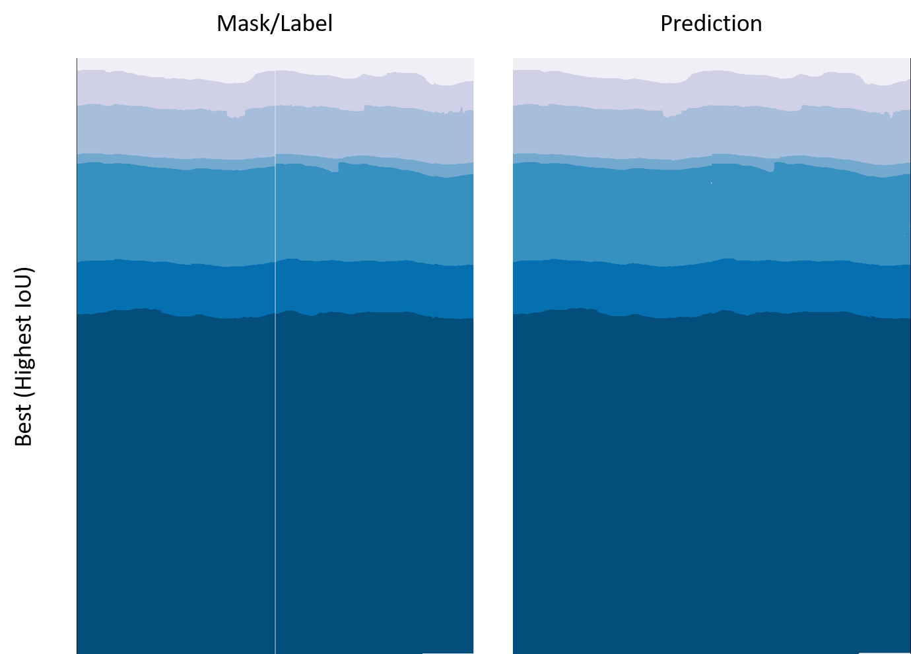

# DeepSeismic


This repository shows you how to perform seismic imaging and interpretation on Azure. It empowers geophysicists and data scientists to run seismic experiments using state-of-art DSL-based PDE solvers and segmentation algorithms on Azure.  

The repository provides sample notebooks, data loaders for seismic data, utility codes, and out-of-the box ML pipelines.


## Interpretation
For seismic interpretation, the repository consists of extensible machine learning pipelines, that shows how you can leverage state-of-the-art segmentation algorithms (UNet, SEResNET, HRNet) for seismic interpretation, and also benchmarking results from running these algorithms using various seismic datasets (Dutch F3, and Penobscot).

To run examples available on the repo, please follow instructions below to:
1) [Set up the environment](#setting-up-environment)
2) [Download the data sets](#dataset-download-and-preparation)
3) [Run example notebooks and scripts](#run-examples)

### Setting up Environment

Follow the instruction bellow to read about compute requirements and install required libraries.

<details>
  <summary><b>Compute environment</b></summary>

We recommend using a virtual machine to run the example notebooks and scripts. Specifically, you will need a GPU powered Linux machine, as this repository is developed and tested on Linux only. The easiest way to get started is to use the [Azure Data Science Virtual Machine (DSVM)](https://azure.microsoft.com/en-us/services/virtual-machines/data-science-virtual-machines/). This VM will come installed with all the system requirements that are needed to run the notebooks in this repository. 

For this repo, we recommend selecting an Ubuntu VM of type [Standard_NC6_v3](https://docs.microsoft.com/en-us/azure/virtual-machines/windows/sizes-gpu#ncv3-series). The machine is powered by NVIDIA Tesla V100 GPU which can be found in most Azure regions.

> NOTE: For users new to Azure, your subscription may not come with a quota for GPUs. You may need to go into the Azure portal to increase your quota for GPU VMs. Learn more about how to do this here: https://docs.microsoft.com/en-us/azure/azure-subscription-service-limits.

</details>

<details>
  <summary><b>Package Installation</b></summary>

To install packages contained in this repository, navigate to the directory where you pulled the DeepSeismic repo to run:
```bash
conda env create -f environment/anaconda/local/environment.yml
```
This will create the appropriate conda environment to run experiments.

Next you will need to install the common package for interpretation:
```bash
conda activate seismic-interpretation
pip install -e interpretation
```

Then you will also need to install `cv_lib` which contains computer vision related utilities:
```bash
pip install -e cv_lib
```

Both repos are installed in developer mode with the `-e` flag. This means that to update simply go to the folder and pull the appropriate commit or branch. 

During development, in case you need to update the environment due to a conda env file change, you can run
```
conda env update --file environment/anaconda/local/environment.yml
```
from the root of DeepSeismic repo.

</details>

### Dataset download and preparation

This repository provides examples on how to run seismic interpretation on two publicly available annotated seismic datasets: [Penobscot](https://zenodo.org/record/1341774) and [F3 Netherlands](https://github.com/olivesgatech/facies_classification_benchmark).

#### Penobscot
To download the Penobscot dataset run the [download_penobscot.sh](scripts/download_penobscot.sh) script, e.g.

```
data_dir='/data/penobscot'
mkdir $data_dir
./scripts/download_penobscot.sh $data_dir
```

Note that the specified download location (e.g `/data/penobscot`) should be configured with appropriate `write` pemissions.

To prepare the data for the experiments (e.g. split into train/val/test), please run the following script (modifying arguments as desired):

```
python scripts/prepare_penobscot.py split_inline --data-dir=/data/penobscot --val-ratio=.1 --test-ratio=.2
```

#### F3 Netherlands
To download the F3 Netherlands dataset for 2D experiments, please follow the data download instructions at
[this github repository](https://github.com/yalaudah/facies_classification_benchmark) (section Dataset).

Once you've downloaded the data set, make sure to create an empty `splits` directory, under the downloaded `data` directory. This is where your training/test/validation splits will be saved.

```
cd data
mkdir splits
```

At this point, your `data` directory tree should look like this:

```
data
├── splits
├── test_once
│   ├── test1_labels.npy
│   ├── test1_seismic.npy
│   ├── test2_labels.npy
│   └── test2_seismic.npy
└── train
    ├── train_labels.npy
    └── train_seismic.npy
```

To prepare the data for the experiments (e.g. split into train/val/test), please run the following script:

```
# For section-based experiments
python scripts/prepare_dutchf3.py split_train_val section --data-dir=/mnt/dutchf3


# For patch-based experiments
python scripts/prepare_dutchf3.py split_train_val patch --data-dir=/mnt/dutchf3 --stride=50 --patch=100

```

Refer to the script itself for more argument options.

### Run Examples

#### Notebooks
We provide example notebooks under `examples/interpretation/notebooks/` to demonstrate how to train seismic interpretation models and evaluate them on Penobscot and F3 datasets. 

Make sure to run the notebooks in the conda environment we previously set up (`seismic-interpretation`). To register the conda environment in Jupyter, please run:

```
python -m ipykernel install --user --name seismic-interpretation
```

#### Experiments

We also provide scripts for a number of experiments we conducted using different segmentation approaches. These experiments are available under `experiments/interpretation`, and can be used as examples. Within each experiment start from the `train.sh` and `test.sh` scripts under the `local/` (single GPU) and `distributed/` (multiple GPUs) directories, which invoke the corresponding python scripts, `train.py` and `test.py`. Take a look at the experiment configurations (see Experiment Configuration Files section below) for experiment options and modify if necessary.

Please refer to individual experiment README files for more information. 

#### Configuration Files
We use [YACS](https://github.com/rbgirshick/yacs) configuration library to manage configuration options for the experiments. There are three ways to pass arguments to the experiment scripts (e.g. train.py or test.py):

- __default.py__ - A project config file `default.py` is a one-stop reference point for all configurable options, and provides sensible defaults for all arguments. If no arguments are passed to `train.py` or `test.py` script (e.g. `python train.py`), the arguments are by default loaded from `default.py`. Please take a look at `default.py` to familiarize yourself with the experiment arguments the script you run uses.

- __yml config files__ - YAML configuration files under `configs/` are typically created one for each experiment. These are meant to be used for repeatable experiment runs and reproducible settings. Each configuration file only overrides the options that are changing in that experiment (e.g. options loaded from `defaults.py` during an experiment run will be overridden by arguments loaded from the yaml file). As an example, to use yml configuration file with the training script, run:

    ```
    python train.py --cfg "configs/hrnet.yaml"
    ```

- __command line__ - Finally, options can be passed in through `options` argument, and those will override arguments loaded from the configuration file. We created CLIs for all our scripts (using Python Fire library), so you can pass these options via command-line arguments, like so:

    ```
    python train.py DATASET.ROOT "/mnt/dutchf3" TRAIN.END_EPOCH 10
    ```


### Pretrained Models
#### HRNet
To achieve the same results as the benchmarks above you will need to download the HRNet model pretrained on ImageNet. This can be found [here](https://1drv.ms/u/s!Aus8VCZ_C_33dKvqI6pBZlifgJk). Download this to your local drive and make sure you add the path to the experiment (or notebook) configuration file.

### Viewers (optional)

For seismic interpretation (segmentation), if you want to visualize cross-sections of a 3D volume (both the input velocity model and the segmented output) you can use
[segyviewer](https://github.com/equinor/segyviewer). To install and use segyviewer, please follow the instructions below.

#### segyviewer

To install [segyviewer](https://github.com/equinor/segyviewer) run:
```bash
conda env create -n segyviewer python=2.7
conda activate segyviewer
conda install -c anaconda pyqt=4.11.4
pip install segyviewer
```

To visualize cross-sections of a 3D volume, you can run
[segyviewer](https://github.com/equinor/segyviewer) like so:
```bash
segyviewer /mnt/dutchf3/data.segy
```

### Benchmarks

#### Dense Labels

This section contains benchmarks of different algorithms for seismic interpretation on 3D seismic datasets with densely-annotated data.

Below are the results from the models contained in this repo. To run them check the instructions in <benchmarks> folder. Alternatively take a look in <examples> for how to run them on your own dataset

#### Netherlands F3

|    Source        |    Experiment                     |    PA       |    FW IoU    |    MCA     |
|------------------|-----------------------------------|-------------|--------------|------------|
|    Alaudah et al.|    Section-based                  |    0.905    |    0.817     |    .832    |
|                  |    Patch-based                    |    0.852    |    0.743     |    .689    |
|    DeepSeismic   |    Patch-based+fixed              |    .869     |    .761      |    .775    |
|                  |    SEResNet UNet+section depth    |    .917     |    .849      |    .834    |
|                  |    HRNet(patch)+patch_depth       |    .908     |    .843      |    .837    |
|                  |    HRNet(patch)+section_depth     |    .928     |    .871      |    .871    |

#### Penobscot

Trained and tested on full dataset. Inlines with artefacts were left in for training, validation and testing.
The dataset was split 70% training, 10% validation and 20% test. The results below are from the test set

|    Source        |    Experiment                       |    PA       |    IoU       |    MCA     |
|------------------|-------------------------------------|-------------|--------------|------------|
|    DeepSeismic   |    SEResNet UNet + section depth    |    1.0      |    .98        |    .99    |
|                  |    HRNet(patch) + section depth     |    1.0      |    .97        |    .98    |




#### Scripts
- [parallel_training.sh](scripts/parallel_training.sh): Script to launch multiple jobs in parallel. Used mainly for local hyperparameter tuning. Look at the script for further instructions

- [kill_windows.sh](scripts/kill_windows.sh): Script to kill multiple tmux windows. Used to kill jobs that parallel_training.sh might have started.


## Seismic Imaging
For seismic imaging, the repository shows how you can leverage open-source PDE solvers (e.g. Devito), and perform Full-Waveform Inversion (FWI) at scale on Azure, using Azure Machine Learning (Azure ML), and Azure Batch. The repository provides a collection of sample notebooks that shows 

* How you can create customized Docker containers with Devito and use this on Azure
* How you can create Azure ML estimators for performing FWI using Devito. 
This enable the Devito code to easily run on a single machine, as well as multiple machines using Azure ML managed computes.


## Contributing

This project welcomes contributions and suggestions. Most contributions require you to agree to a Contributor License Agreement (CLA) declaring that you have the right to, and actually do, grant us the rights to use your contribution. For details, visit https://cla.opensource.microsoft.com.

### Submitting a Pull Request

We try to keep the repo in a clean state, which means that we only enable read access to the repo - read access still enables one to submit a PR or an issue. To do so, fork the repo, and submit a PR from a branch in your forked repo into our staging branch.

When you submit a pull request, a CLA bot will automatically determine whether you need to provide a CLA and decorate the PR appropriately (e.g., status check, comment). Simply follow the instructions provided by the bot. You will only need to do this once across all repos using our CLA.

This project has adopted the [Microsoft Open Source Code of Conduct](https://opensource.microsoft.com/codeofconduct/). For more information see the [Code of Conduct FAQ](https://opensource.microsoft.com/codeofconduct/faq/) or contact [opencode@microsoft.com](mailto:opencode@microsoft.com) with any additional questions or comments.

## Build Status
| Build | Branch | Status |
| --- | --- | --- |
| **Legal Compliance** | staging | [](https://dev.azure.com/best-practices/deepseismic/_build/latest?definitionId=110&branchName=staging) |
| **Legal Compliance** | master | [](https://dev.azure.com/best-practices/deepseismic/_build/latest?definitionId=110&branchName=master) |
| **Tests** | staging | [](https://dev.azure.com/best-practices/deepseismic/_build/latest?definitionId=111&branchName=staging) |
| **Tests** | master | [](https://dev.azure.com/best-practices/deepseismic/_build/latest?definitionId=111&branchName=master) |
| **Notebook Tests** | staging | [](https://dev.azure.com/best-practices/deepseismic/_build/latest?definitionId=120&branchName=staging) |
| **Notebook Tests** | master | [](https://dev.azure.com/best-practices/deepseismic/_build/latest?definitionId=120&branchName=master) |

# Related projects

[Microsoft AI Labs Github](https://aka.ms/ai-labs) Find other Best Practice projects, and Azure AI design patterns in our central repository. 


